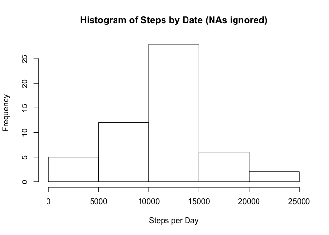
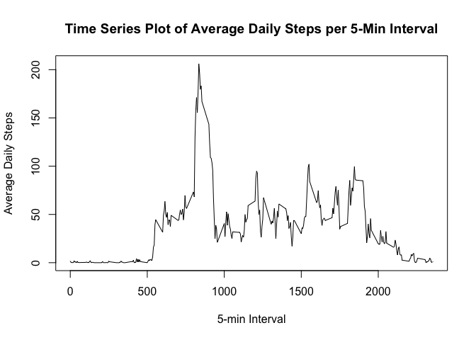
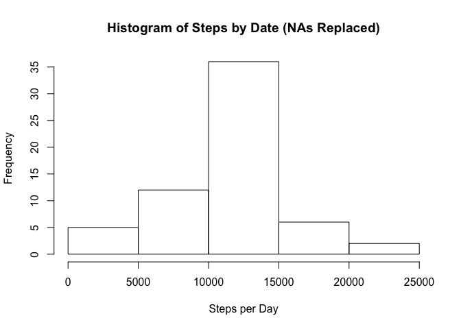
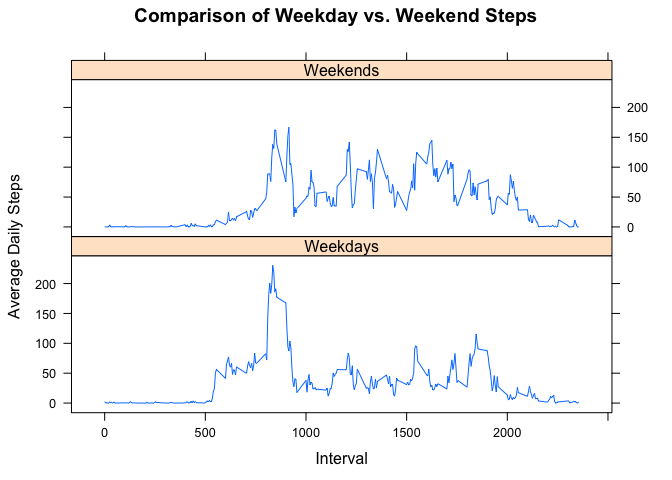

# Reproducible Research: Peer Assessment 1

### Notes:
* PA1_template.md and PA1_template.html are in the working directory
* The figures created in the Rmd file are located in ./PA1_template_files/figure-html

## Loading and preprocessing the data
### This code chunk performs the following steps:
* Create a temporary file
* Download the activity file and unzip it into the temporary file
* Read the csv file into a data frame and dispose of the temporary file
* Clean up the data frame date column and copy it into a new data frame


```r
temp <- tempfile()
download.file("https://d396qusza40orc.cloudfront.net/repdata%2Fdata%2Factivity.zip", method="curl", temp)
data <- read.csv(unz(temp, "activity.csv"))
unlink(temp)
#Transform the data frame into something useful
attach(data)
data1 <- data.frame(steps, date = as.Date(as.character(date)), interval, row.names = NULL)
detach(data)
attach(data1)
```

## What is mean total number of steps taken per day?
### This code chunk performs the following steps:
* Aggregate the total number of steps by date, ignoring the NA values
* Plot a histogram of the daily step totals
* Report on the mean of the daily step totals
* Report on the median of the daily step totals


```r
#Calculating the total number of steps taken each day
stepsBydate <- aggregate(steps ~ date, data1, sum)
#Creating a histogram of the results
hist(stepsBydate$steps, main = "Histogram of Steps by Date (NAs ignored)", xlab = "Steps per Day")
```

 

```r
#Reporting the mean and median of the total steps per day
mean(stepsBydate$steps)
```

```
## [1] 10766.19
```

```r
median(stepsBydate$steps)
```

```
## [1] 10765
```

## What is the average daily activity pattern?
### This code chunk performs the following steps:
* Aggregate the average (mean) steps in each 5-minute interval across all days
* Plot a time series of the activity as if it were an average day
* Calculates *which* 5-minute interval has the highest number of steps, on average
* Notes the peak value


```r
#Calculate average steps per 5-minute interval averaged across all days
stepsByinterval <- aggregate(steps ~ interval, data1, mean)
plot(stepsByinterval$interval, stepsByinterval$steps, type = "l", xlab = "5-min Interval", ylab = "Average Daily Steps", main = "Time Series Plot of Average Daily Steps per 5-Min Interval")
```

 

```r
#Calculate the 5 min interval in which the highest number of daily steps are taken
stepsByinterval$interval[which.max(stepsByinterval$steps)]
```

```
## [1] 835
```

```r
# And note the number of steps
stepsByinterval$steps[which.max(stepsByinterval$steps)]
```

```
## [1] 206.1698
```

## Imputing missing values
### This code chunk performs the following steps:
* Calculates and reports the total number of NA rows
* Replaces each NA with the mean of the number of steps for that 5-min interval
* Recalculates the aggregate daily step totals and replots the histogram
* Reports the mean and median daily step totals


```r
#Total number of NA values in the data set
sum(is.na(steps))
```

```
## [1] 2304
```

```r
#index of the na value rows
ind <- which(is.na(steps), arr.ind = TRUE)
#Use the stepsByinterval mean to replace the na values
data1$steps[ind] <- stepsByinterval$steps[match(data1$interval[ind], stepsByinterval$interval)]
# Recalculate the histogram and mean/median
stepsBydate <- aggregate(steps ~ date, data1, sum)
hist(stepsBydate$steps, main="Histogram of Steps by Date (NAs Replaced)", xlab = "Steps per Day")
```

 

```r
#Reporting the new mean and median of the total steps per day
mean(stepsBydate$steps)
```

```
## [1] 10766.19
```

```r
median(stepsBydate$steps)
```

```
## [1] 10766.19
```

### Here are the observations of the effects of replacing the NAs:
* The mean remains unchanged
* The median has changed slightly and now reflects the same number as the mean
* The histogram reflects slightly more days with higher step totals, which would be expected

## Are there differences in activity patterns between weekdays and weekends?
### This code chunk performs the following steps:
* Creates a factor variable in the tidy dataset for Weekdays and Weekends
* Aggregates the interval mean for Weekdays, Weekends and then binds the two data frames
* Plots a time series in two panels using the lattice package to compare Weekdays and Weekends


```r
#Factor the data by weekdays and aggregate by mean of the intervals
data1$weekday <- factor(weekdays(data1$date)!="Saturday" & weekdays(data1$date) != "Sunday")
levels(data1$weekday) <- c("Weekends", "Weekdays")
stepsByint1 <- aggregate(steps ~ interval, subset(data1, data1$weekday == "Weekdays"), mean)
stepsByint1$day <- "Weekdays"
stepsByint2 <- aggregate(steps ~ interval, subset(data1, data1$weekday == "Weekends"), mean)
stepsByint2$day <- "Weekends"
stepsByint3 <- rbind(stepsByint1, stepsByint2)
stepsByint3$day <- as.factor(stepsByint3$day)
library(lattice)
xyplot(stepsByint3$steps ~ stepsByint3$interval | stepsByint3$day, type = "l", layout = c(1,2), xlab = "Interval", ylab = "Average Daily Steps", main = "Comparison of Weekday vs. Weekend Steps")
```

 

### Looking at the comparison of the two plots
* The activity levels still peak in the mornings
* The mid-day activity for the weekends is much higher
